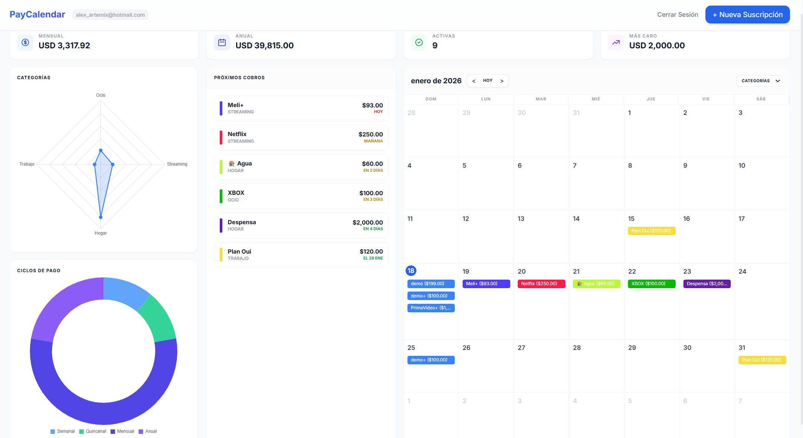

# PayCalendar 🚀

Aplicación web para el seguimiento de suscripciones y gastos.



## Funcionalidades
- Registrar suscripciones con ciclo de cobro (semanal, mensual, anual).
- Visualización en calendario mensual.
- Cálculo automático de próxima fecha de renovación.
- Estadísticas de gasto mensual y anual.
- Alertas visuales: Hoy (Rojo), Pronto (Amarillo), Futura (Verde).
- Filtrado por categorías.

## Stack Tecnológico
- **Backend:** PHP 8+ (MVC ligero, PDO/SQLite)
- **Frontend:** Vanilla JavaScript, Tailwind CSS (CDN)
- **Base de Datos:** SQLite (No requiere configuración externa)

## Instrucciones de Instalación

### Requisitos
- PHP 8.0 o superior instalado.
- Extensión `pdo_sqlite` habilitada en PHP.

### Opción 1: Servidor Local de PHP (Recomendado)
Desde la raíz del proyecto, ejecuta:
```bash
php -S localhost:8000 -t public
```
Luego abre `http://localhost:8000` en tu navegador.

### Opción 2: Apache / Nginx
1. Copia el contenido a tu directorio web (`htdocs` o `/var/www/html`).
2. Asegúrate de que el servidor web tenga permisos de escritura en la carpeta `database/` para poder crear el archivo SQLite.
3. Configura el `DocumentRoot` para que apunte a la carpeta `public/`.

## Estructura del Proyecto
- `/app`: Lógica del servidor (Modelos, Controladores, Vistas).
- `/public`: Archivos accesibles públicamente (index.php, CSS, JS).
- `/database`: Esquema SQL y archivo de base de datos SQLite.
- `config.php`: Configuración global.
